# movie-reservation project explanation

This document explains the project structure, major components, data flow, and function-level behavior. It also includes diagrams for the main request flows.

## 1. Project overview

This is a Go REST API for movie reservations using Fiber, PostgreSQL (via pgxpool), and JWT auth. The core flow is:

- `main.go` loads environment variables, connects to DB, starts the Fiber app.
- `routes/` defines API endpoints and connects them to `handlers/`.
- `middleware/` enforces JWT auth on protected routes.
- `handlers/` parse requests, validate input, and call `services/`.
- `services/` contain business logic and all DB access via `config.DB`.
- `models/` define request/DB payload structures.

## 2. Entry point and configuration

- `main.go`
  - `config.LoadEnv()` loads `.env` (if present).
  - `config.ConnectDB()` creates a pgx pool using `DB_URL`.
  - `routes.Setup(app)` registers all endpoints.
  - `app.Listen(" :PORT ")` starts the server.

- `config/env.go`
  - `LoadEnv()` loads `.env` with `godotenv`.
  - `GetEnv(key)` reads environment variables.

- `config/db.go`
  - `ConnectDB()` initializes `config.DB` via `pgxpool.New`.

## 3. Routing and middleware

- `routes/routes.go` defines paths under `/api`.
  - Public: `/register`, `/login`.
  - Protected groups:
    - `/movie/*` for movie and booking operations.
    - `/timetable/*` for showtime and admin reporting.
    - `/user/*` for user operations.

- `middleware/auth.go`
  - `Protected` expects `Authorization: Bearer <token>`.
  - Verifies `JWT_SECRET` is set and token is valid.
  - Extracts `user_id` and `role` into `c.Locals`.

## 4. Data models

- `models/User`: `id`, `name`, `email`, `role`, `password`.
- `models/Movie`: `id`, `title`, `description`, `poster_url`, `genre`.
- `models/MovieTimetable`: `id`, `movie_id`, `timings`, `screens`, `show_date`, `normal_price`, `vip_price`.
- `models/Screen`: `id`, `screen_no`, `normal`, `vip`, `type`.
- `models/Bookings` and `models/BookingDetail`: DB booking payloads.

## 5. High-level request flow

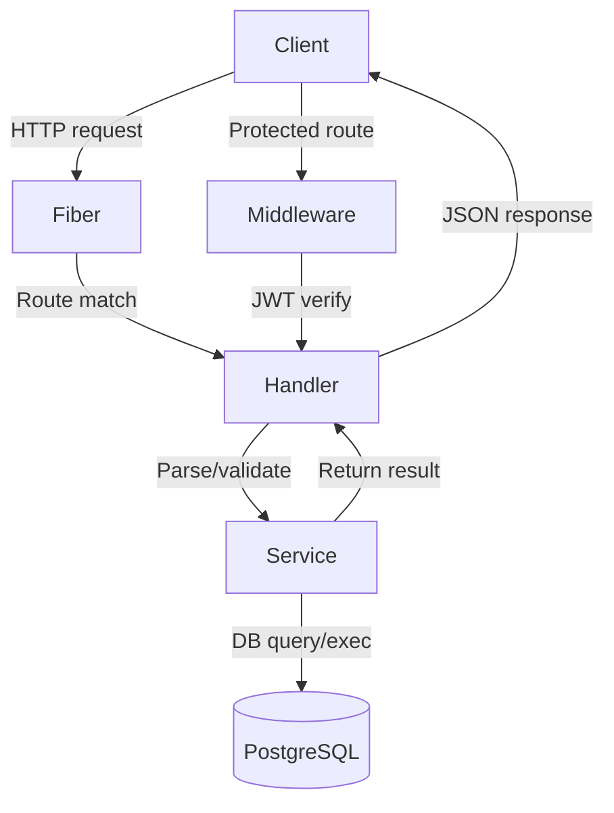

## 6. Auth and user flows

### 6.1 Register

Handler: `handlers.Register` -> Service: `services.CreateUser`

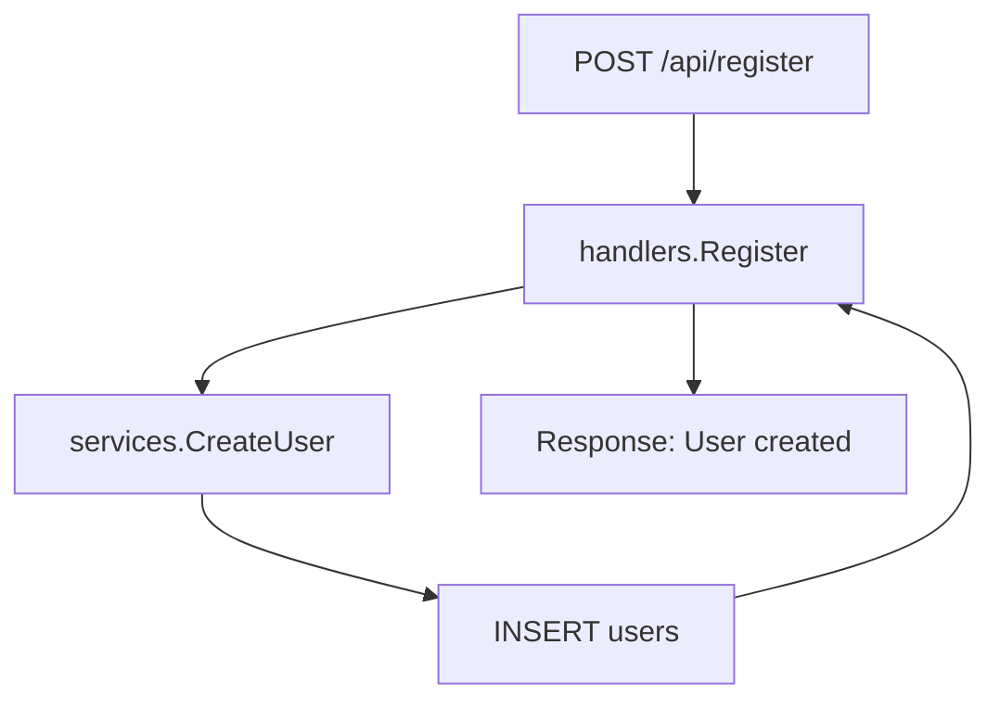

Key logic:
- `Register` parses `models.User` from body.
- `CreateUser` hashes password with bcrypt and inserts into `users`.

### 6.2 Login

Handler: `handlers.Login` -> Services: `services.GetUserByEmail`, `services.GenerateToken`

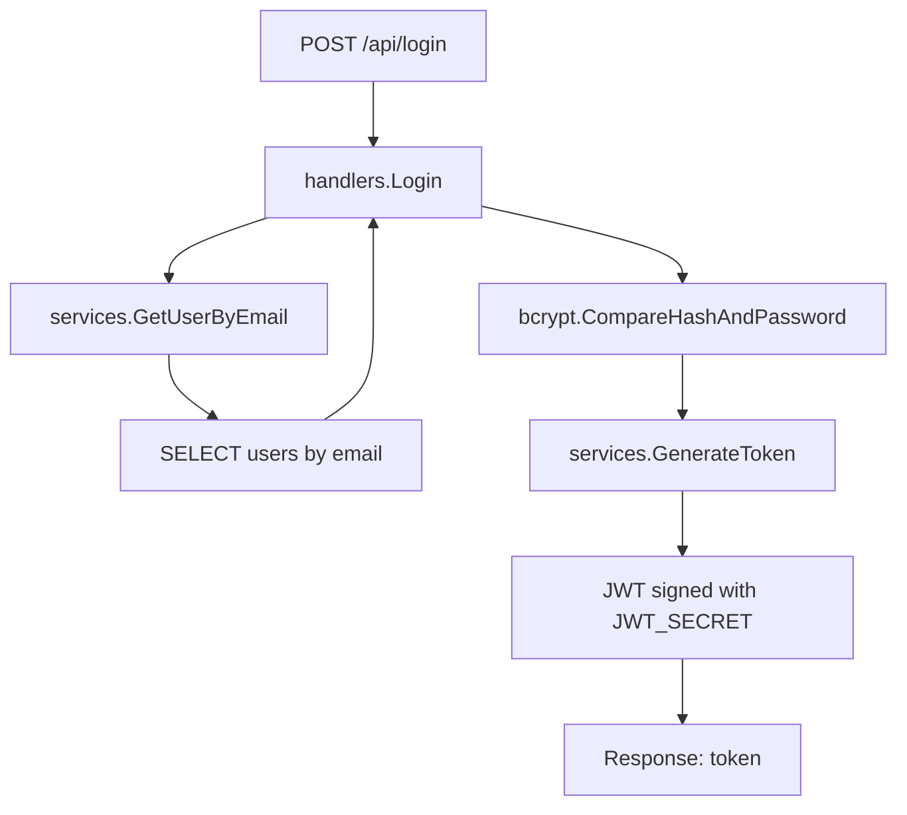

Key logic:
- `GetUserByEmail` loads hashed password.
- `Login` verifies password and returns JWT.

### 6.3 Promote user

Handler: `handlers.Promote` -> Service: `services.PromoteToAdmin`

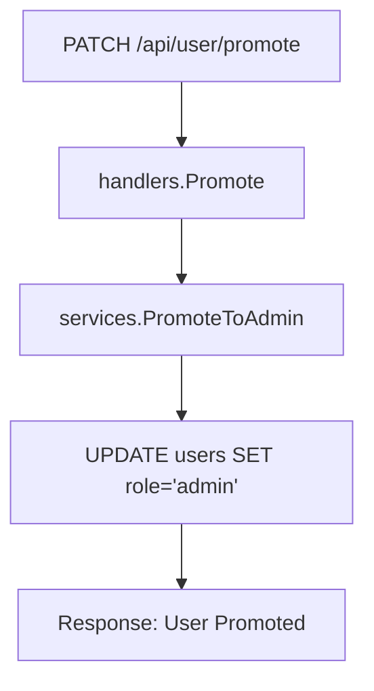

## 7. Movie management flows

### 7.1 Add movie (admin)

Handler: `handlers.AddMovie` -> Service: `services.Add_Movie`

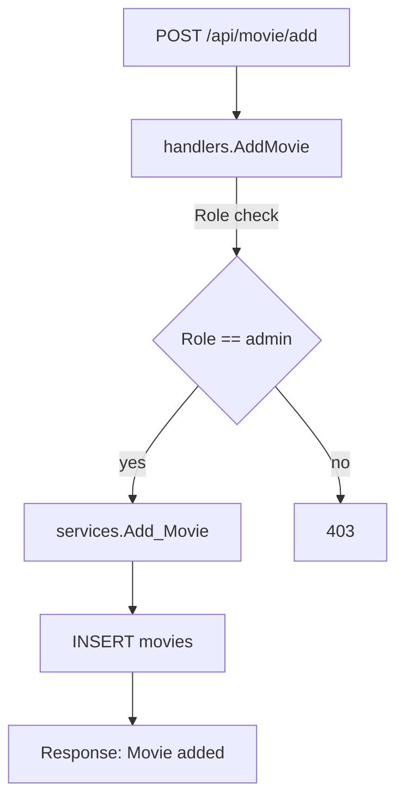

### 7.2 Update movie (admin)

Handler: `handlers.UpdateMovie` -> Service: `services.Update_Movie`

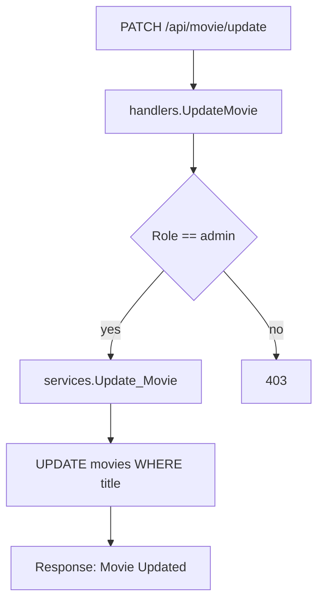

### 7.3 Delete movie (admin)

Handler: `handlers.DeleteMovie` -> Service: `services.Delete_Movie`

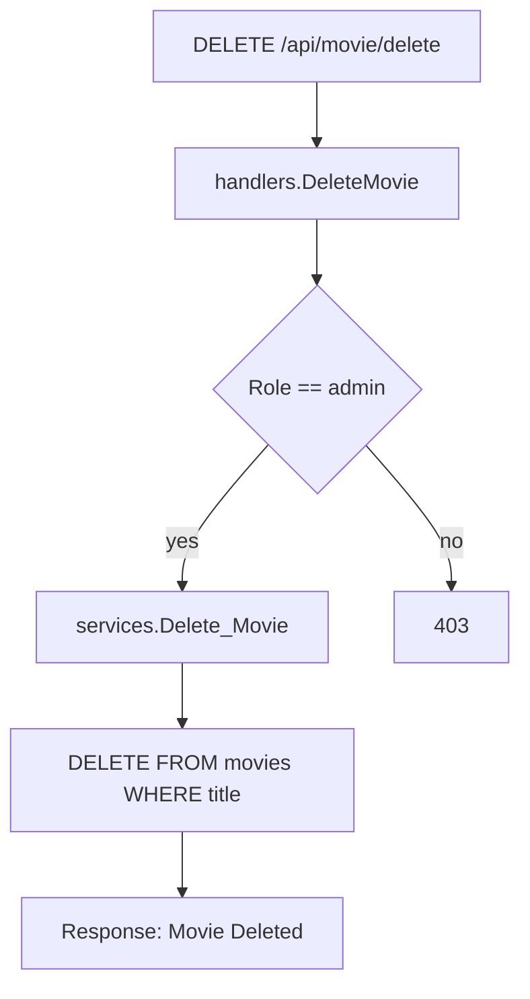

### 7.4 Get movies

Handler: `handlers.GetMovies` -> Service: `services.Get_Movies`

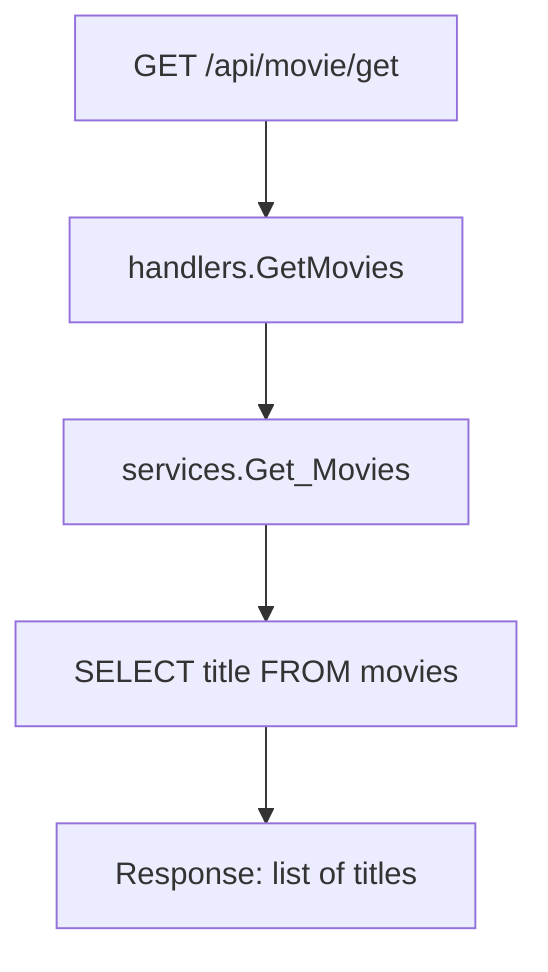

### 7.5 Get movie timings

Handler: `handlers.GetMovieTimings` -> Service: `services.GetMovieTimings`

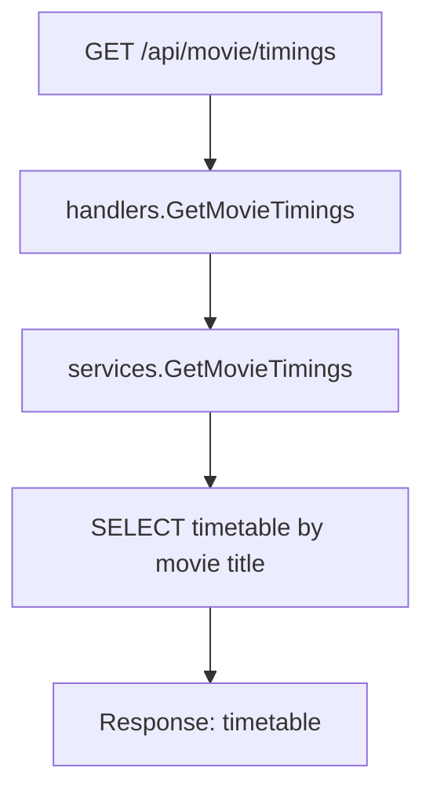

## 8. Timetable management flows

### 8.1 Add showtime (admin)

Handler: `handlers.AddShowTime` -> Service: `services.AddShowTime`

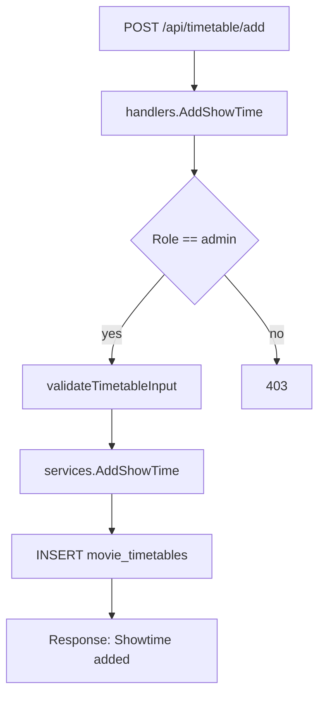

Validation checks in `validateTimetableInput`:
- Required IDs, timings, screens, and prices.
- Show date cannot be in the past.
- No duplicate timings or screens.

### 8.2 Update showtime (admin)

Handler: `handlers.UpdateShowTime` -> Service: `services.UpdateShowTime`

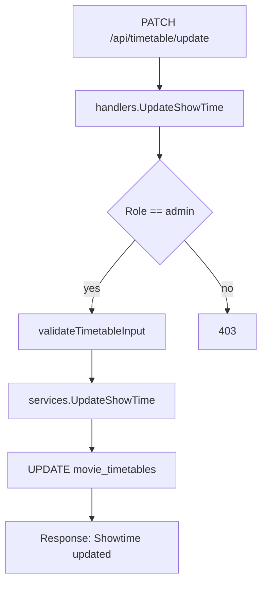

## 9. Booking and capacity flows

### 9.1 Reserve movie

Handler: `handlers.ReserveMovie` -> Service: `services.ReserveTicket`

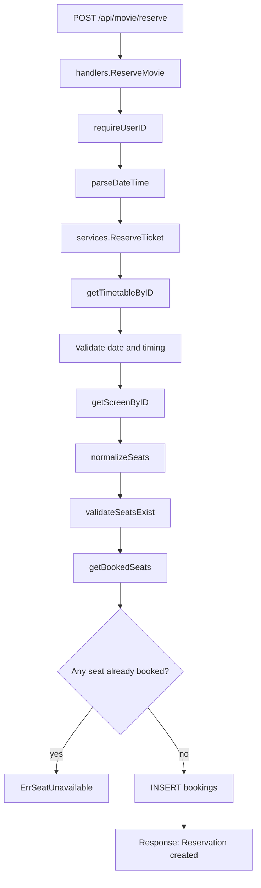

Key checks:
- Reservation time must be in the future.
- Timetable date and time must match requested show.
- Seats must exist in the selected screen.
- Duplicate seats in the request are rejected.
- Already booked seats return conflict.

### 9.2 Cancel reservation

Handler: `handlers.CancelReservation` -> Service: `services.CancelReservation`

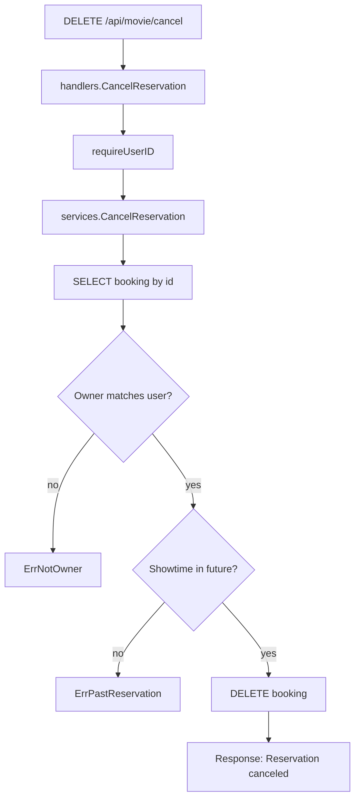

### 9.3 Get capacity (admin)

Handler: `handlers.GetCapacity` -> Service: `services.GetCapacity`

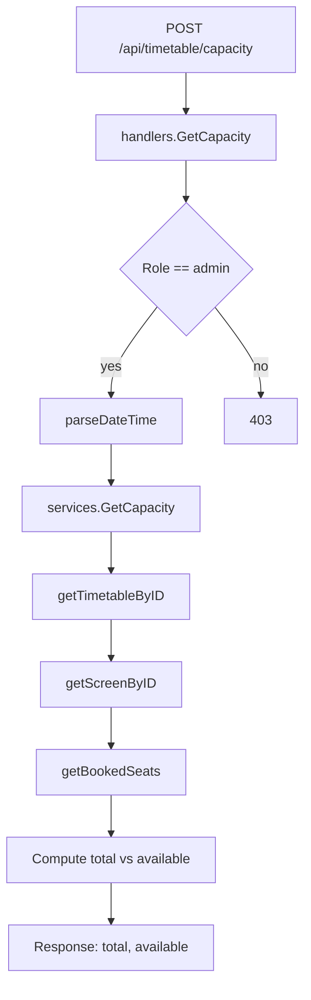

### 9.4 Get revenue (admin)

Handler: `handlers.GetRevenue` -> Service: `services.GetMovieRevenue`

```mermaid
flowchart TD
    A[POST /api/timetable/revenue] --> B[handlers.GetRevenue]
    B --> C{Role == admin}
    C -->|yes| D[services.GetMovieRevenue]
    D --> E[Query bookings + timetables]
    E --> F[getScreenByID (cached)]
    F --> G[Count normal/vip seats]
    G --> H[Sum revenue]
    H --> I[Response: revenue]
    C -->|no| J[403]
```

### 9.5 Get all bookings (admin)

Handler: `handlers.GetAllReservations` -> Service: `services.GetAllBookings`

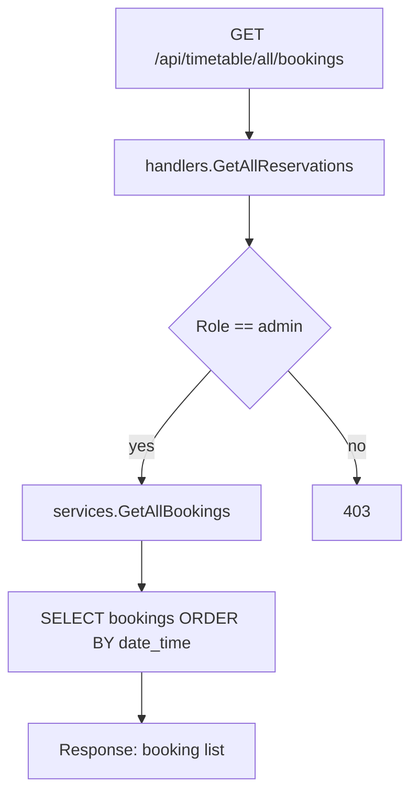

## 10. Service helpers and error flow

Key errors from `services/booking_service.go`:
- `ErrSeatUnavailable` -> HTTP 409
- `ErrInvalidShowtime` or `ErrPastReservation` -> HTTP 400
- `ErrNotFound` -> HTTP 404
- `ErrNotOwner` -> HTTP 403

The handlers map these error values to status codes in a consistent way.

Helper functions used by booking services:
- `getTimetableByID`, `getScreenByID` (DB lookups)
- `getBookedSeats` (aggregation of reserved seats)
- `normalizeSeats`, `validateSeatsExist`
- `matchesTiming` (compares showtime to timetable slots)
- `isSameDate` (date comparison)

## 11. Database shape (inferred)

From SQL in services, the DB likely has tables:

- `users(id, name, email, role, password)`
- `movies(id, title, description, poster_url, genre)`
- `movie_timetables(id, movie_id, timings, screens, show_date, normal_price, vip_price)`
- `screens(id, screen_no, normal, vip, type)`
- `bookings(id, user_id, timetable_id, screen_id, reservation, date_and_time)`

Note: `genre`, `timings`, `screens`, `normal`, `vip`, and `reservation` are stored as array columns (Go slices in models).

## 12. Test coverage overview

- `main_test.go` and `config/env_test.go` validate `.env` loading behavior.
- `middleware/auth_test.go` tests JWT error cases and valid token pass-through.
- `services/services_test.go` checks JWT generation.

## 13. Outstanding or stubbed areas

- `services/screen_service.go` contains placeholders and is not used.
- No explicit schema migrations or DB setup scripts are included.

## 14. End-to-end flow summary

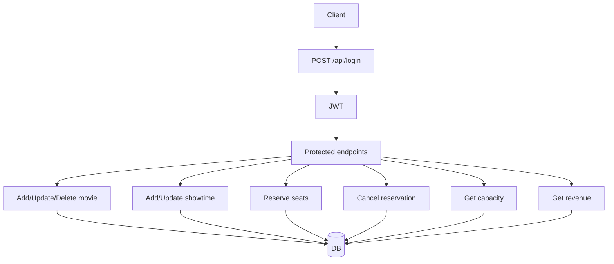
